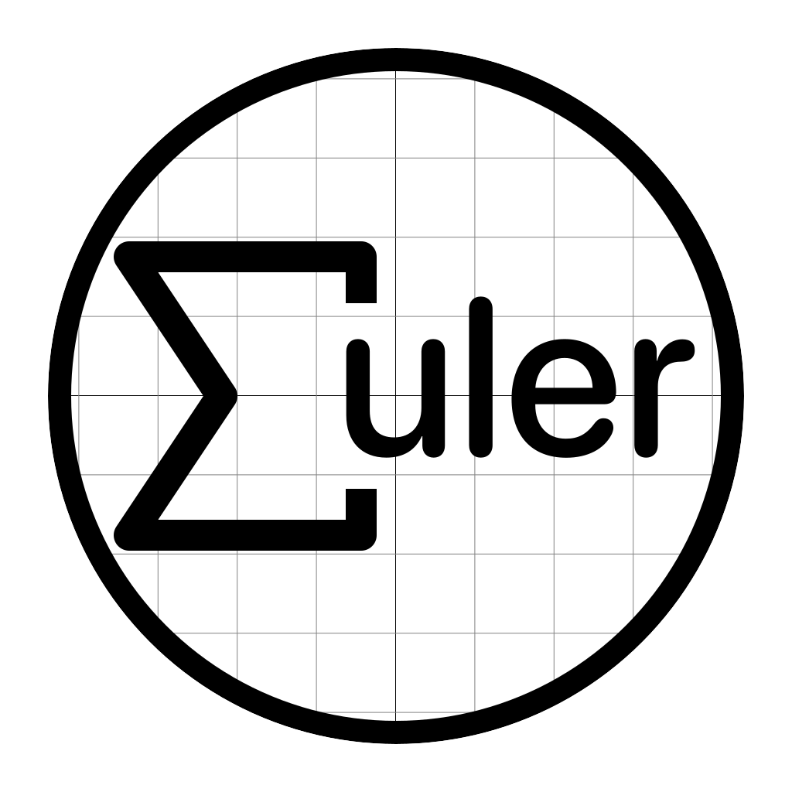

<h1>Euler [WIP]</h1>
A computanional framework written in Swift

Euler is a mathematical framework that is packed up with tons of useful mathematical functions. It is composed of functions in most mathematical fields such as algebra, number theory, statistics, etc... It was designed to help you turn your computer into a mathematical guru.
# Links
- **Documentation:** https://euler.arguiot.com

# Showcase
Here is a list of apps using Euler to work (not exhaustive)

> **Euclid Calculator**
>
> Euclid is a modern and fully featured calculator for macOS that aims to replace the default calculation app. Euclid uses Euler to parse and evaluate every calculations. It relies heavily on the Algebra and Tables modules.

# Project
### Inspiration

The project was largely inspired by:
- [TheoremJS](https://theorem.js.org)
- [SymPy](https://www.sympy.org/)
- [Swift BigInt](https://github.com/mkrd/Swift-BigInt)
- [Wolfram Language](https://www.wolfram.com/language/)

### Why Swift
In retrospect, it isn’t a surprise that Swift is a good fit for the needs of this project. Swift was designed and built by a close-knit team. That team previously built a highly modular and composable compiler infrastructure (LLVM), a compiler and runtime for a highly dynamic Smalltalk-derived language (Objective-C), the compiler for a highly static language with a capable generics system (C++), and a path-sensitive static analysis engine (the Clang static analyzer). Furthermore, the goals for Swift’s design was to build something that was as easy to learn and use as a scripting language, but which had enough power to be used as a system’s programming language.

Swift was the perfect language, because of its performance, modularity, easy to read syntax and concurrency APIs. Swift aims to maximize clarity of code, and thus it fights to reduce boilerplate. The top-end goal of Swift is to optimize the time it takes to write and maintain the project, which includes debugging time and other things that go beyond just pounding out the code.

### Goal
Euler aims to provide provide the building blocks of numerical computing in Swift, as a set of fine-grained modules bundled together into a single Swift package. Euler is intended to be used to experiment with Swift and with its math capabilities. It also aims to serve as an algorithm database that could be ported to other languages.
### Organization
Euler is built around two main objects: `BigDouble` and `BigInt`. They are both used to represent big numbers with precision. You can see Euler as a set of modules:
- Numerics: `BigDouble` / `BigInt` & more
	> Helps to work with numbers
- Algebra: `Expression`
	> Helps parsing and working with mathematical expressions
- Tables
	> `Tables` was made for developing Excel-like software / parser.
- Statistics
	> `Statistics` was designed to help with the mathematics of the collection, organization, and interpretation of numerical data, especially the analysis of population characteristics by inference from sampling.

- Visualisation & Geometry (`Graph`)
	> Utility for visualizing any set of `Point` using SwiftPlot.
- Matrix & Vectors
	> Simple Matrix/Vector type. :warning: It only works on Apple devices, where 	`Accelerate` is supported.
- Cryptography
	> Basic crypto algorithm implemented. We don’t recommend using this in production as this is more for experimental purpose.

